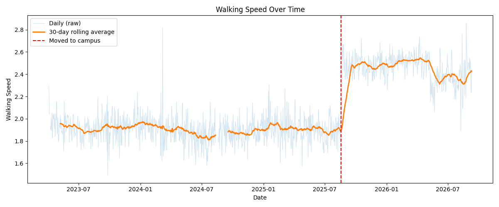
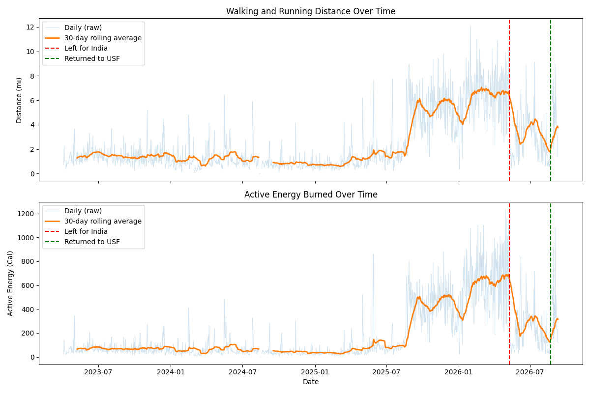

# Apple Health Data Analysis

Cleaning and analyzing 3+ years of my own Apple Health data — steps, distance, energy burned, and walking-quality metrics — to see what my real activity patterns actually look like, and to practice building a real data pipeline from a messy, real-world file.

I built this project to investigate how my transition from India to USF appeared in my recorded activity patterns. Using my own health data let me work through real data-quality challenges and distinguish measurable trends from assumptions about what caused them.

## What this does

Turns a raw Apple Health export (`export.xml`, 179MB, 4M+ lines) into clean, analyzable daily data, then explores it:

1. **`extract_data.py`** — streams through the 179MB XML file line-by-line (never loading the whole thing into memory) and pulls out six health metrics, writing them to `raw_records.csv` (337,072 individual readings).
2. **`clean_data.py`** — aggregates those readings into one row per day (`daily_summary.csv`, 1,254 days), using `sum` for cumulative metrics (steps, distance, energy burned) and `mean` for rate metrics (walking speed, step length) — and explicitly preserves "no data that day" as missing rather than a misleading `0`.
3. **`plot_steps.py`** — visualizes daily step count over the full time range.
4. **`find_cutoff.py`** / **`readings_per_day.py`** — investigate whether an apparent shift in the data reflects a real behavior change or just a tracking artifact (see *What I found*).
5. **`weekday_weekend.py`** — compares average steps on weekdays vs. weekends over the current, densely-tracked period.
6. **`speed_vs_steplength.py`** — checks the relationship between walking speed and step length.
7. **`plot_speed_trend.py`** — plots daily walking speed over time with a 30-day rolling average, marking the date I moved to campus.
8. **`compare_speed.py`** — compares average walking speed in the 60 days before vs. the 60 days after the move, using equal-length, non-overlapping windows.
9. **`plot_distance_energy.py`** — plots daily walking/running distance and active energy burned over time, each with a 30-day rolling average, marking both my summer trip to India and my return to USF.

## Tech used

Python, `re` (regex), `pandas`, `matplotlib`, git/GitHub.

## Project structure

```
health-data-analysis/
├── extract_data.py           # XML -> raw_records.csv
├── clean_data.py              # raw_records.csv -> daily_summary.csv
├── plot_steps.py               # daily_summary.csv -> daily_steps.png
├── find_cutoff.py               # data-completeness check, by month
├── readings_per_day.py           # tracking-density check, by month
├── weekday_weekend.py             # daily_summary.csv -> weekday_vs_weekend.png
├── speed_vs_steplength.py          # daily_summary.csv -> speed_vs_steplength.png
├── plot_speed_trend.py             # daily_summary.csv -> speed_trend.png
├── compare_speed.py                # before/after move-date comparison (prints results)
├── plot_distance_energy.py         # daily_summary.csv -> distance_energy_trend.png
├── daily_summary.csv          # cleaned daily data (committed — aggregated, not raw)
├── daily_steps.png, weekday_vs_weekend.png, speed_vs_steplength.png, speed_trend.png, distance_energy_trend.png
├── .gitignore                 # excludes the raw export (size + personal-data privacy)
└── README.md
```

## Setup & usage

```bash
pip install pandas matplotlib
```

Get your own export: iPhone Health app → profile icon → **Export All Health Data**, unzip it, place `export.xml` in this folder. Then run the pipeline in order:

```bash
python3 extract_data.py       # -> raw_records.csv
python3 clean_data.py         # -> daily_summary.csv
python3 plot_steps.py         # -> daily_steps.png
python3 weekday_weekend.py    # -> weekday_vs_weekend.png
python3 speed_vs_steplength.py  # -> speed_vs_steplength.png
python3 plot_speed_trend.py     # -> speed_trend.png
python3 compare_speed.py        # -> prints before/after move comparison
python3 plot_distance_energy.py # -> distance_energy_trend.png
```

## What I found

**1. A clear shift in daily step counts starting around mid-2025.** Before that point, daily totals are mostly under 10K steps; after it, they're consistently 10K–20K+. My first guess was that this was largely a tracking-consistency artifact (i.e., my phone just wasn't capturing data reliably before). I checked this directly rather than assuming it:

- **Day-level completeness** (what % of days have *any* recorded step data) turned out to be near 100% almost the entire way through, from April 2023 onward — ruling out "the phone just wasn't tracking" as the explanation.
- **Reading density** (how many individual step-count entries land on an average day) does increase somewhat starting mid-2025 — roughly 30–40% more readings per day — but that's far too small to explain the ~2.5–3x jump in total daily steps.

**Conclusion:** the shift is mostly a real behavior change, not a measurement artifact — consistent with starting college and walking to classes, which is the explanation I had going in. The tracking-density increase is real but a minor contributor, not the main story. (I initially over-attributed this to tracking inconsistency before checking — worth being upfront that the more careful analysis walked that back.)

**2. Weekdays average more steps than weekends, since starting college.** Restricted to the current, densely-tracked period (Aug 2025–present): weekdays average **12,589 steps**, weekends **11,485** — roughly a 10% difference. Consistent with extra walking on class days, though it's a modest gap, not a dramatic one.

**3. Walking speed and step length are very strongly correlated (r = 0.978).** Daily average walking speed and step length showed a strong positive correlation. These measures are physically related, and shared measurement methods (both likely derived from the same underlying stride-detection data) may contribute to the association. This analysis does not establish causation or separate genuine behavioral patterns from measurement effects.

**4. Average walking speed increased from 1.886 mph in the 60 days before my move to 2.463 mph in the 60 days after (+30.60%), with complete daily data in both windows.** This period also coincides with moving from India to the United States, changing my daily routes, and deliberately aiming for 10,000 steps a day, so this finding cannot be attributed to campus walking specifically. It shows that my recorded walking speed increased around this lifestyle transition, not that walking on campus caused the increase.



**5. Distance and active energy also decreased during my summer return to India and increased after returning to USF.** This supports finding #4: recorded activity levels track changes in my location and daily routine, rather than appearing to be a one-time fluctuation tied to my initial move. (Note: because both metrics use a 30-day rolling average, the visible dip and recovery lag a few weeks behind the actual travel dates — the smoothing blends in the prior weeks' higher values before it catches up.)



## Data & privacy

`export.xml` and `raw_records.csv` are intentionally excluded from this repo (see `.gitignore`) for two reasons: they're large (179MB / 25MB), and they contain real personal health data at a fine-grained, timestamped level. `daily_summary.csv` — aggregated to daily totals — is committed, since I'm comfortable sharing that level of detail publicly.

## Limitations

- No Apple Watch data in this export — no heart rate or sleep data, only iPhone motion-sensor metrics (steps, distance, walking quality).
- The weekday/weekend and correlation analyses cover roughly the last year (since Aug 2025) rather than the full 3+ years, by choice — this reflects my current routine rather than a data-quality exclusion.
- This is one person's data — not meant to generalize beyond my own patterns.
- The speed/step-length correlation may partly reflect how the two metrics are measured, not just biomechanics — see write-up above.

## What's next

- Final polish pass and a proper results write-up.

## Lessons learned

Memory-efficient file reading matters once "large file" stops being theoretical — 179MB is small enough to get away with sloppy habits, but the pattern (stream, don't load-all) is the one that scales. A chart with a caveat you can defend is worth more than a chart with a confident claim you can't. And the most useful moment in this whole project was being wrong about the tracking-artifact theory and having the data correct me — checking an assumption instead of keeping it is the actual skill, not just building charts that look plausible.
